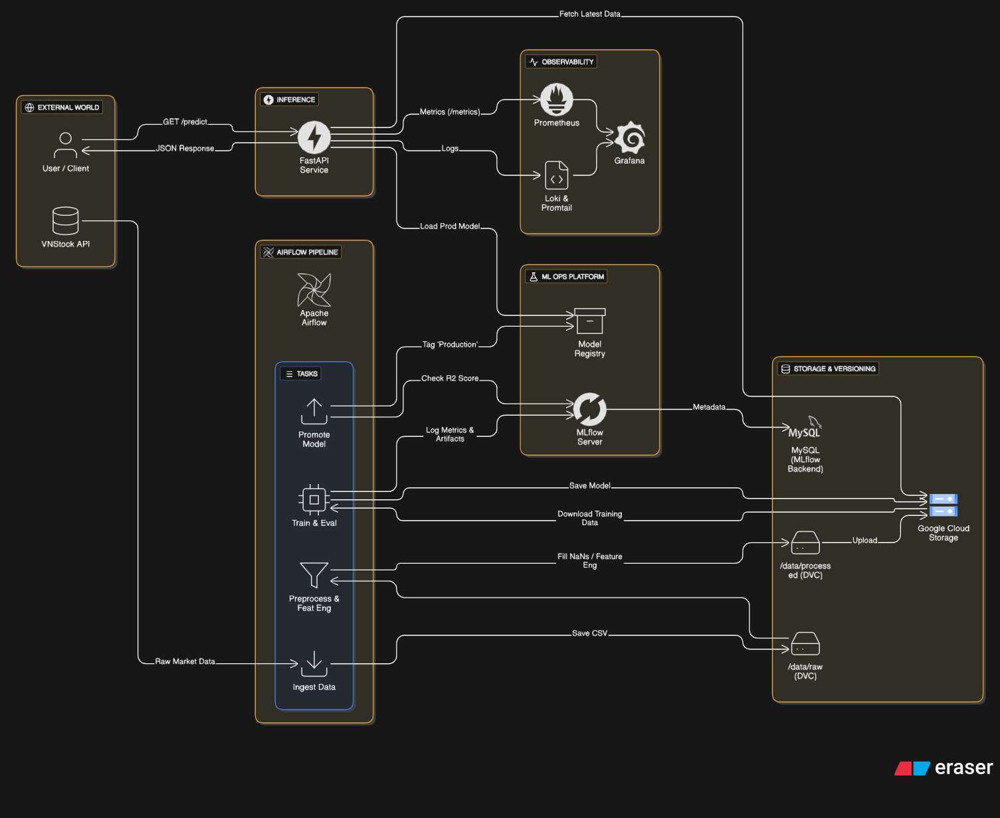
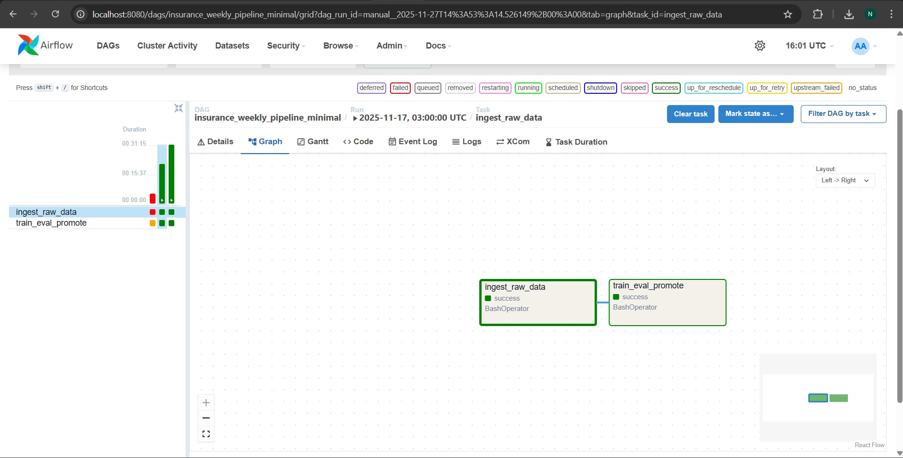
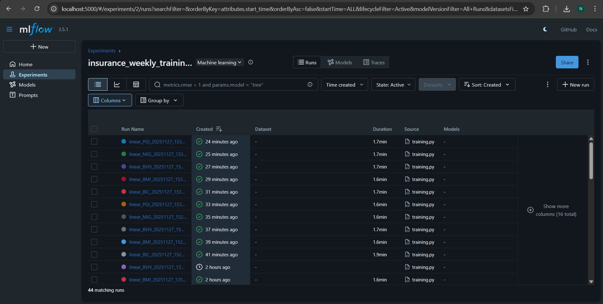
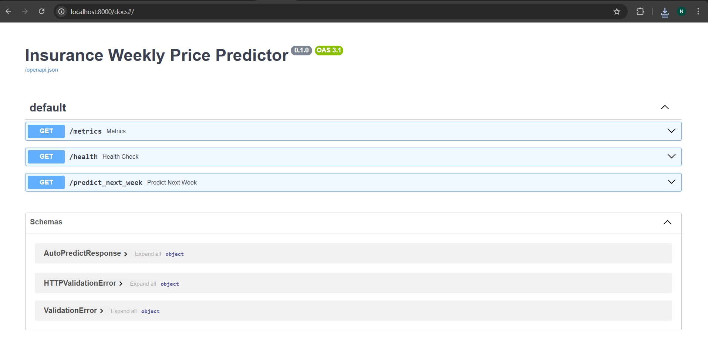
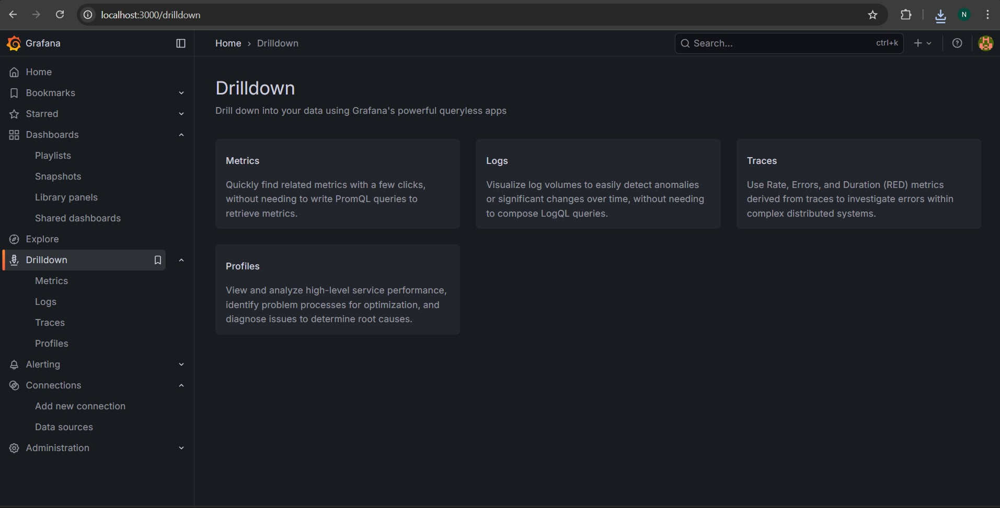
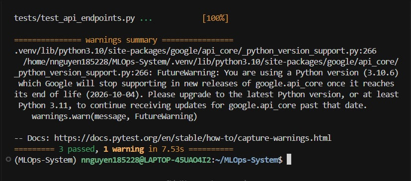

# End-to-End MLOps System: Vietnamese Insurance Stock Prediction

This project is a fully containerized, production-grade MLOps system designed to predict weekly closing prices for top 5 insurance companies listed on HOSE (Ho Chi Minh City Stock Exchange): **BIC, BMI, BVH, MIG, PGI**.

The system automates the lifecycle from data ingestion to model deployment using **Airflow**, **MLflow**, **FastAPI**, **Docker**, and **Grafana**.



---

## 🚀 Project Overview

*   **Goal:** Predict next week's closing price (`1_week_ahead`) for insurance stocks.
*   **Model:** Linear Regression.
*   **Data Source:** `vnstock` (live market data).
*   **Features:**
    *   Lag Features: `close_lag1`, `close_lag2`
    *   Rolling Statistics: `ma_5` (Moving Average), `ma_10`, `std_5` (Standard Deviation).
*   **Preprocessing:** Handling missing values via Forward Fill (`ffill`), Backward Fill (`bfill`), and Linear Interpolation.
*   **Evaluation Metric:** R-squared ($R^2$). Models are promoted to **Production** only if they outperform the currently deployed version.

---

## 🛠 Tech Stack

*   **Orchestration:** Apache Airflow
*   **Experiment Tracking & Registry:** MLflow (Backend: MySQL/CloudSQL, Artifacts: GCS)
*   **Data Versioning:** DVC (Git tracking) & Google Cloud Storage (Processed data)
*   **Model Serving:** FastAPI
*   **Containerization:** Docker & Docker Compose
*   **Monitoring:** Prometheus, Grafana, Loki, Promtail
*   **Testing:** Pytest

---

## 📋 Prerequisites

Before running the project, ensure you have:

1.  **Docker & Docker Compose** installed.
2.  A **Google Cloud Platform (GCP) Service Account** JSON key with permissions to read/write to your GCS bucket (`mlops-tiker-bucket`).

---

## ⚡ Quick Start (Installation & Running)

Follow these steps exactly to get the system up and running.

## 1. Installation & Local Setup

Start by cloning the repository and setting up your local Python environment. We use **[uv](https://github.com/astral-sh/uv)** for ultra-fast package management and virtual environment creation.

### 1.1 Clone the Repository
```bash
git clone https://github.com/namnguyen8a/namnguyen8a-end-to-end-mlops-system.git
cd namnguyen8a-end-to-end-mlops-system
```

### 1.2 Install `uv`
If you do not have `uv` installed, run one of the following commands:

```bash
# MacOS / Linux
curl -LsSf https://astral.sh/uv/install.sh | sh

# Windows (PowerShell)
powershell -c "irm https://astral.sh/uv/install.ps1 | iex"

# Or via standard pip
pip install uv
```

### 1.3 Create & Activate Virtual Environment
Initialize a clean virtual environment in your project root and activate it:

```bash
# 1. Create virtual environment
uv venv

# 2. Activate virtual environment
# On MacOS / Linux:
source .venv/bin/activate

# On Windows:
.venv\Scripts\activate
```

### 1.4 Install Dependencies
Install all project requirements using `uv` (significantly faster than standard pip):

```bash
uv pip install -r requirements.txt
```

## 2. Infrastructure & Credentials Setup

Before running the system, you must set up the cloud infrastructure and configure local credentials for Data Version Control (DVC) and MLflow.

### 2.1 Google Cloud Platform (GCP) Setup

#### A. Cloud Storage Bucket (For Data & Artifacts)
1.  Go to **GCP Console** > **Cloud Storage** > **Buckets**.
2.  Create a bucket named **`mlops-tiker-bucket`** (or your preferred unique name).
3.  **Permissions:** Ensure "Enforce public access prevention" is ON (Not public).
4.  This bucket will store:
    *   Raw data (`/raw-data`)
    *   Processed data (`/processed-data`)
    *   MLflow artifacts (`/mlflow-artifacts`)

#### B. Cloud SQL Instance (For MLflow Backend)
1.  Go to **GCP Console** > **SQL** > **Create Instance** > **MySQL**.
2.  **Instance ID:** `mlflow-backend`.
3.  **User:** Create a user named `mlflowuser` with a strong password.
4.  **Database:** Create a database named `mlflowdb`.
5.  **Networking:**
    *   Check **Public IP**.
    *   Add your current IP address (search "what is my ip") to the **Authorized Networks** section named `home-access`.
    *   *Note: If your local IP changes, you must update this setting.*

### 2.2 Service Account Credentials
1.  Go to **IAM & Admin** > **Service Accounts**.
2.  Create a new service account (e.g., `mlflow-artifact-access`).
3.  Assign the role **Storage Object Admin** (Required to read/write data & artifacts).
4.  Go to the **Keys** tab > **Add Key** > **Create new key** (JSON).
5.  Download the key file.
6.  **Action:** Rename the file to `service-account.json` (or match the config in `docker-compose.yml`) and move it to your project's `config/` folder.
    ```bash
    mv ~/Downloads/your-key-file.json ./config/able-bazaar-477311-s0-e7b9ea511911.json
    ```

### 2.3 Data Version Control (DVC) Setup
Initialize DVC to handle data syncing with your GCS bucket.

1.  **Initialize DVC:**
    ```bash
    dvc init
    ```

2.  **Configure Remotes:**
    Map specific bucket folders to DVC remotes. Use the `--local` flag to store credentials in `.dvc/config.local` (which is git-ignored).

    ```bash
    # 1. Add Default Remote (Raw Data)
    dvc remote add -d myremote gs://mlops-tiker-bucket/raw-data
    dvc remote modify --local myremote credentialpath config/able-bazaar-477311-s0-e7b9ea511911.json

    # 2. Add Processed Data Remote
    dvc remote add processed gs://mlops-tiker-bucket/processed-data
    dvc remote modify --local processed credentialpath config/able-bazaar-477311-s0-e7b9ea511911.json
    ```

3.  **Verify Configuration:**
    ```bash
    dvc remote list
    # Output should show:
    # myremote  gs://mlops-tiker-bucket/raw-data
    # processed gs://mlops-tiker-bucket/processed-data
    ```

4.  **Pull Data (If exists):**
    ```bash
    dvc pull
    ```

### 2.4 Update Docker Environment
Update your `docker-compose.yml` (specifically the `mlflow` command) to point to your Cloud SQL instance.

*   **Find:** `--backend-store-uri`
*   **Update:** `mysql+pymysql://mlflowuser:<encoded-password>@<sql-public-ip>:3306/mlflowdb`
    *   *Note:* If your password has special characters (e.g., `@`, `/`), URL-encode them (e.g., `pass@word` -> `pass%40word`).
    *   Replace `<sql-public-ip>` with the IP found on your Cloud SQL Overview page.

### 3. Build and Start Services
Launch the entire stack using Docker Compose.

```bash
docker-compose up -d --build
```
*Wait for a few minutes for all containers (Airflow, MLflow, MySQL, etc.) to initialize.*

### 4. ⚠️ CRITICAL: Install Dependencies in Airflow
Due to library conflicts in the base Airflow image, you must manually install specific scientific libraries inside the running scheduler container for the DAG to execute the training pipeline successfully.

Run the following command:
```bash
docker compose exec airflow-scheduler /usr/local/bin/python -m pip install \
  mlflow pandas scikit-learn vnstock google-cloud-storage
```

### 5. ⚠️ CRITICAL: Fix Data Permissions
To ensure Airflow and other services can read/write to the mounted `data/` volume without permission errors, run the included utility script:

```bash
bash src/utils/fix_perms.sh
```

---

## 🖥️ Accessing the Services

Once the system is running, you can access the user interfaces via your browser:

| Service | URL | Default Credentials | Description |
| :--- | :--- | :--- | :--- |
| **Airflow** | `http://localhost:8080` | `admin` / `admin` | Pipeline orchestration |
| **MLflow** | `http://localhost:5000` | N/A | Experiment tracking & Registry |
| **FastAPI** | `http://localhost:8000/docs` | N/A | Prediction API Swagger UI |
| **Grafana** | `http://localhost:3000` | `admin` / `admin` | System monitoring |
| **Report** | `http://localhost:8081` | N/A | Static report viewer |

---

## 🔄 The MLOps Pipeline (Airflow DAG)

The core logic is defined in `airflow/dags/insurance_weekly_pipeline_minimal.py`. It runs automatically every Monday at 03:00 or can be triggered manually.

### 1. Data Ingestion
*   Scripts: `src/ingest/vnstock_client.py`
*   Fetches raw historical data for the 5 tickers from `vnstock`.
*   Saves raw data to `data/raw/`.

### 2. Preprocessing & Upload
*   Scripts: `src/preprocess/processed_data.py`, `src/utils/upload_processed_to_gcs.py`
*   Cleans data (interpolation, filling NaNs).
*   Generates `*_weekly_clean.csv`.
*   Uploads processed data to Google Cloud Storage (GCS) for the training task to access.

### 3. Training & Evaluation
*   Scripts: `src/training/training.py`
*   Downloads data from GCS.
*   Performs Feature Engineering (`lag1`, `lag2`, `ma5`, `ma10`, `std5`).
*   Trains a Linear Regression model for each ticker.
*   Logs parameters, metrics (MAE, RMSE, $R^2$), and artifacts (model, scaler) to **MLflow**.
*   Registers the model in the MLflow Model Registry (Stage: `Staging`).

### 4. Model Promotion
*   Scripts: `src/utils/promote_best_models.py`
*   Compares the `Staging` model's $R^2$ against the current `Production` model.
*   If the new model is better, it is promoted to `Production`.
*   **FastAPI** automatically loads the model tagged as `Production`.

### 📸 Airflow DAG Screenshot


---

## 🧪 Experiment Tracking (MLflow)

Every training run is logged. You can visualize the performance of different feature sets or hyperparameters.

*   **Tags:** `feature_engineering`, `model_type`, `ticker`.
*   **Artifacts:** The trained `sklearn` model and the `StandardScaler` are saved for reproducibility.

### 📸 MLflow UI Screenshot


---

## 🚀 Model Serving (FastAPI)

The API serves predictions using the models currently in the **Production** stage.

**Endpoint:** `GET /predict_next_week`

**Example Request:**
```bash
curl -X 'GET' \
  'http://localhost:8000/predict_next_week?ticker=BIC' \
  -H 'accept: application/json'
```

**Response:**
```json
{
  "ticker": "BIC",
  "horizon": "1_week_ahead",
  "predicted_close": 24500.5,
  "currency": "VND",
  "generated_at_utc": "2025-11-27T10:00:00Z",
  "model_uri": "models:/BIC_weekly_linear/Production",
  "latest_time": "2025-11-23T00:00:00"
}
```

### 📸 FastAPI Swagger UI Screenshot


---

## 📊 Monitoring (Grafana)

We use **Prometheus** to scrape metrics from the FastAPI application and **Promtail/Loki** to aggregate logs.

*   **RPS (Requests Per Second):** Traffic monitoring.
*   **Latency:** 99th percentile response time.
*   **Prediction Count:** Total predictions served.
*   **Logs:** Real-time container logs from the ML service.

### 📸 Grafana Dashboard Screenshot


---

## 🧪 Testing

The project includes a test suite using `pytest` to verify API endpoints and GCS paths.

To run tests:
```bash
# Run tests inside the API container
pytest 
```

### 📸 Pytest Output Screenshot


---

## 📂 Directory Structure

```text
namnguyen8a-end-to-end-mlops-system/
├── airflow/               # Airflow configuration and DAGs
├── artifacts/             # Local storage for training artifacts
├── config/                # Secrets and configuration files
├── data/                  # Data directory (Raw & Processed)
├── docker/                # Dockerfiles for specific services
├── logs/                  # Application logs
├── models/                # Model logic (if separated)
├── notebooks/             # Jupyter notebooks for exploration
├── src/                   # Source code
│   ├── api/               # FastAPI application
│   ├── ingest/            # Data collection scripts
│   ├── monitoring/        # Prometheus/Grafana config
│   ├── preprocess/        # Cleaning logic
│   ├── training/          # Training pipeline
│   └── utils/             # Helper scripts (permissions, GCS upload)
├── tests/                 # Unit and Integration tests
├── docker-compose.yml     # Service orchestration
└── requirements.txt       # Python dependencies
```

## 📜 License

This project is licensed under the MIT License - see the [LICENSE](LICENSE) file for details.